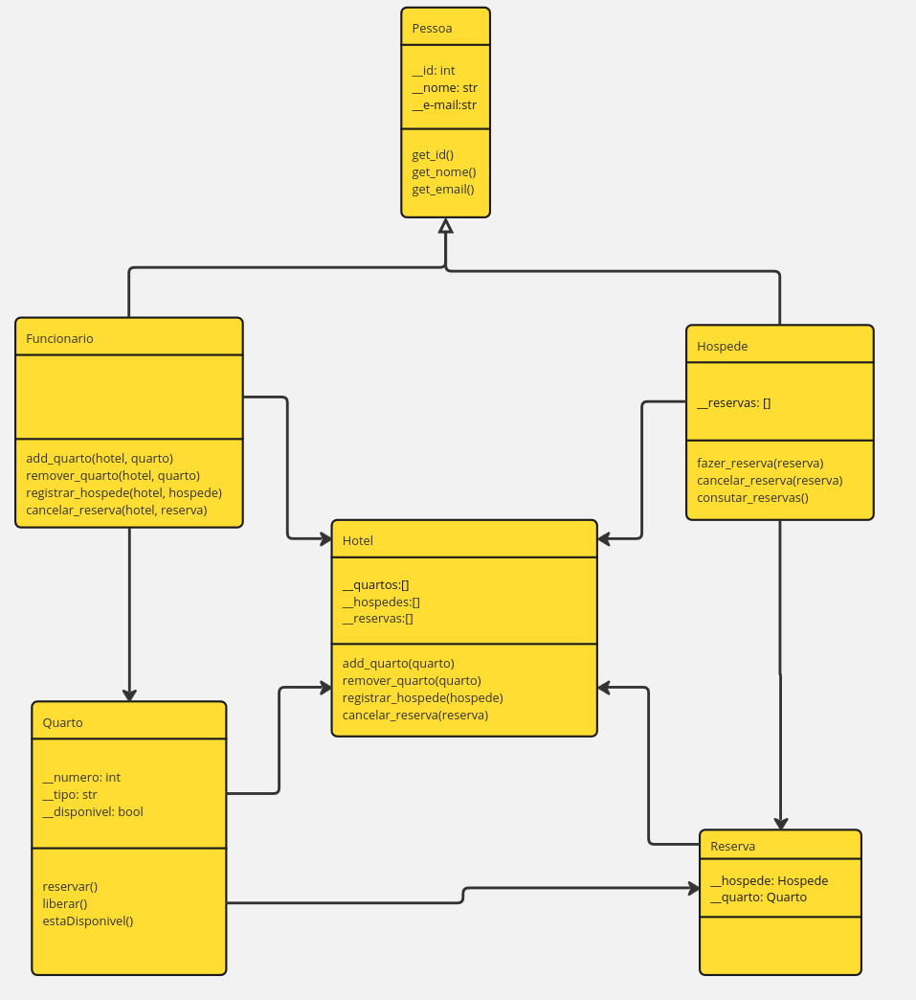

# 🎓 Repositório de Projetos Acadêmicos

Este repositório contém os projetos e trabalhos desenvolvidos durante a graduação em Análise e Desenvolvimento de Sistemas.

O objetivo é centralizar o código, as soluções e as aplicações práticas dos conceitos aprendidos em diversas disciplinas.

## 📚 Projeto da Disciplina: Programação Orientada a Objetos (POO)

### 🏨 Sistema Hotel - Gerenciamento de Reservas

| Detalhe | Informação |
| :--- | :--- |
| **Disciplina** | Programação Orientada a Objetos (POO) |
| **Objetivo** | Desenvolver um sistema para gerenciamento de reservas de quartos, simulando a operação de uma empresa hoteleira. |
| **Conceitos Aplicados** | **Herança**, **Encapsulamento**, **Composição** e Estruturas de Dados. |
| **Classes Implementadas** | `Pessoa`, `Funcionario`, `Hospede`, `Hotel`, `Quarto`, `Reserva`. |
| **Ponto Principal** | Implementação das relações definidas no Diagrama UML. |
| **Tecnologias Utilizadas** |   |

#### 📊 Arquitetura do Sistema

A solução foi desenvolvida seguindo rigorosamente o diagrama de classes UML abaixo, que define a estrutura das classes e as relações de herança e composição.


<div align="center">
    
</div>


#### 💻 Como Executar

O projeto principal que instancia as classes e aciona o fluxo de trabalho do hotel (criação de quartos, registro de hóspedes, realização de reservas, etc.) está no arquivo `main.py`.

1.  Clone este repositório.
2.  Navegue até o diretório do projeto (`/sistema_hotel/`).
3.  Execute o arquivo principal:
    ```bash
    python main.py
    ```
